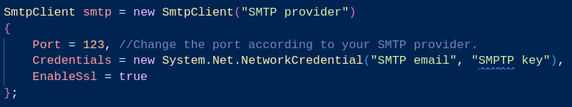

# Swift Docs
A WinForms program that swiftly delivers important documents in PDF or printed form.

## Description
Swift Docs is a program that handles user information and uses it to 'swiftly' deliver important documents to its users, either by sending them in PDF form through the user's provided email or by mailing a printed copy to the user's address.

## Setup
If you want to use this, you may need to set up the SMTP client yourself. You can find the relevant code in FormatForm.cs at line 140.

## Features
- Login and signup functionality.
- Access important documents of choice immediately after signing in.
- Select the desired format: PDF or printed copy.

## Technologies
- Developed using WinForms in C# with .NET Framework 4.8.
- Built on Linux... I know, I know.

